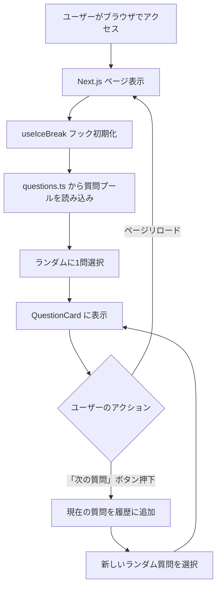
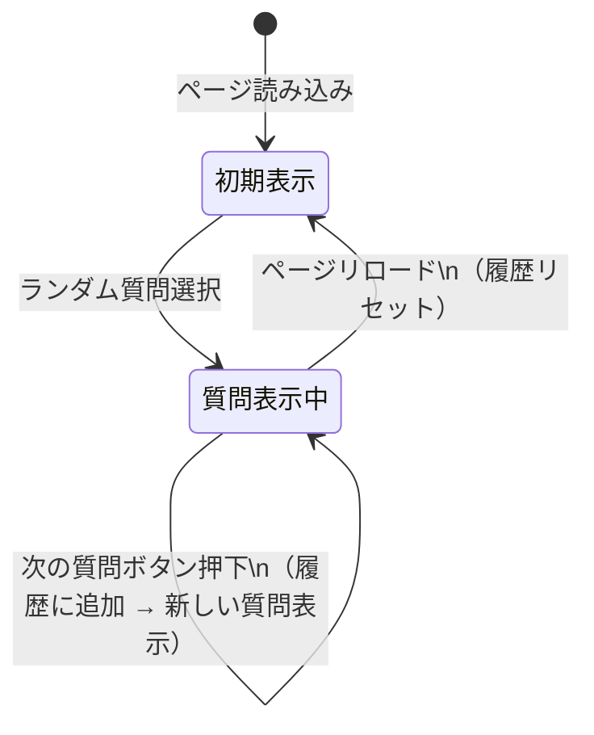
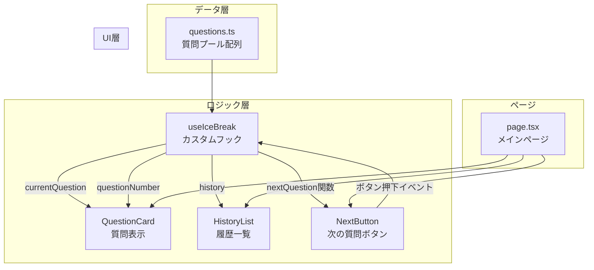
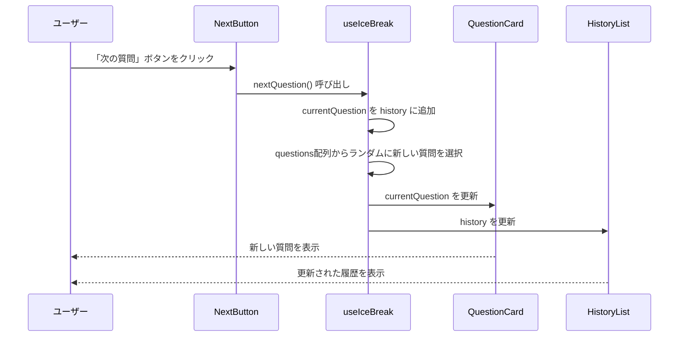
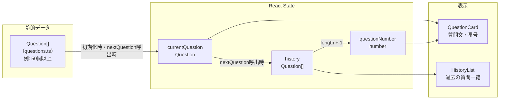

# データフロー図

## ユーザーインタラクションフロー

```mermaid
flowchart TD
    A[ユーザーがブラウザでアクセス] --> B[Next.js ページ表示]
    B --> C[useIceBreak フック初期化]
    C --> D[questions.ts から質問プールを読み込み]
    D --> E[ランダムに1問選択]
    E --> F[QuestionCard に表示]
    F --> G{ユーザーのアクション}
    G --> |「次の質問」ボタン押下| H[現在の質問を履歴に追加]
    H --> I[新しいランダム質問を選択]
    I --> F
    G --> |ページリロード| B
```

---

## 状態遷移フロー

```mermaid
stateDiagram-v2
    [*] --> 初期表示: ページ読み込み
    初期表示 --> 質問表示中: ランダム質問選択
    質問表示中 --> 質問表示中: 次の質問ボタン押下\n（履歴に追加 → 新しい質問表示）
    質問表示中 --> 初期表示: ページリロード\n（履歴リセット）
```

---

## コンポーネント間データフロー

```mermaid
flowchart TD
    subgraph データ層
        Q[questions.ts\n質問プール配列]
    end

    subgraph ロジック層
        H[useIceBreak\nカスタムフック]
        H -->|currentQuestion| QC
        H -->|history| HL
        H -->|questionNumber| QC
        H -->|nextQuestion関数| NB
    end

    subgraph UI層
        QC[QuestionCard\n質問表示]
        NB[NextButton\n次の質問ボタン]
        HL[HistoryList\n履歴一覧]
    end

    subgraph ページ
        P[page.tsx\nメインページ]
        P --> QC
        P --> NB
        P --> HL
    end

    Q --> H
    NB -->|ボタン押下イベント| H
```

---

## シーケンス図：質問切り替え

```mermaid
sequenceDiagram
    participant U as ユーザー
    participant NB as NextButton
    participant Hook as useIceBreak
    participant QC as QuestionCard
    participant HL as HistoryList

    U->>NB: 「次の質問」ボタンをクリック
    NB->>Hook: nextQuestion() 呼び出し
    Hook->>Hook: currentQuestion を history に追加
    Hook->>Hook: questions配列からランダムに新しい質問を選択
    Hook->>QC: currentQuestion を更新
    Hook->>HL: history を更新
    QC-->>U: 新しい質問を表示
    HL-->>U: 更新された履歴を表示
```

---

## データ構造フロー

```mermaid
flowchart LR
    subgraph 静的データ
        A["Question[]<br/>（questions.ts）<br/>例: 50問以上"]
    end

    subgraph React State
        B["currentQuestion<br/>Question"]
        C["history<br/>Question[]"]
        D["questionNumber<br/>number"]
    end

    subgraph 表示
        E["QuestionCard<br/>質問文・番号"]
        F["HistoryList<br/>過去の質問一覧"]
    end

    A -->|初期化時・nextQuestion呼出時| B
    B -->|nextQuestion呼出時| C
    C --> |length + 1| D
    B --> E
    D --> E
    C --> F
```
