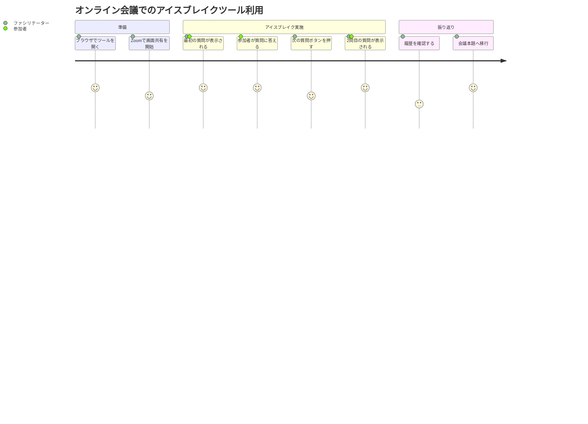

# アイスブレイクツール ユーザストーリー

## 概要

このドキュメントはアイスブレイクツールの詳細なユーザストーリーを記載します。
オンライン会議でファシリテーターや参加者がアイスブレイク質問を手軽に使えるツールです。

## ユーザー種別の定義

### プライマリユーザー

- **ファシリテーター**: 会議の司会者。オンライン会議冒頭でアイスブレイクを実施する担当者。
- **会議参加者**: ファシリテーターが表示した質問に答える参加者（画面共有で閲覧）。

## ユーザストーリー

**【信頼性レベル凡例】**:
- 🔵 **青信号**: ユーザヒアリングを参考にした確実なストーリー
- 🟡 **黄信号**: ユーザヒアリングから妥当な推測によるストーリー
- 🔴 **赤信号**: ユーザヒアリングにない推測によるストーリー

---

### 📚 エピック1: ランダム質問表示 🔵 *ユーザヒアリングより*

#### ストーリー1.1: 会議冒頭でアイスブレイク質問を表示する 🔵

**ユーザストーリー**:
- **私は** ファシリテーター **として**
- **オンライン会議の冒頭において**
- **ランダムなアイスブレイク質問をワンクリックで表示したい**
- **そうすることで** 会議参加者の緊張をほぐし、会話のきっかけを作れる

**詳細説明**:
- **背景**: オンライン会議は対面より雑談のきっかけが少なく、硬い雰囲気になりやすい
- **前提条件**: ツールをブラウザで開いている状態
- **利用シーン**: ZoomやTeamsで画面共有しながらツールを操作する
- **期待する体験**: ボタン1つで面白い質問が出てきて、参加者が笑って答えてくれる

**関連要件**: REQ-001, REQ-002, REQ-101

**優先度**: 高

---

#### ストーリー1.2: 次々と質問を切り替える 🔵

**ユーザストーリー**:
- **私は** ファシリテーター **として**
- **1つの質問が終わったとき**
- **すぐに次の質問に切り替えたい**
- **そうすることで** 会議の流れを止めずに複数の質問を楽しめる

**詳細説明**:
- **背景**: 会議の空き時間に複数の質問を使いたい場面がある
- **前提条件**: すでに1つ目の質問が表示されている状態
- **利用シーン**: 「次の質問」ボタンを押して次のランダム質問を表示
- **期待する体験**: 即座に新しい質問が表示され、テンポよく進められる

**関連要件**: REQ-101, REQ-102

**優先度**: 高

---

### 📚 エピック2: 履歴表示 🔵 *ユーザヒアリング（追加機能）より*

#### ストーリー2.1: これまでに出た質問を振り返る 🔵

**ユーザストーリー**:
- **私は** ファシリテーター **として**
- **会議中に複数の質問を使った後**
- **どの質問をすでに出したか確認したい**
- **そうすることで** 会議の記録として残せる・次回参照できる

**詳細説明**:
- **背景**: 同じ会議で何問使ったか把握したい
- **前提条件**: 1問以上の質問が表示されたことがある状態
- **利用シーン**: 画面下部またはサイドに履歴リストが表示されている
- **期待する体験**: 今まで出た質問が時系列順に並んでいる

**関連要件**: REQ-003, REQ-103, REQ-202

**優先度**: 中

---

### 📚 エピック3: UI/UX体験 🔵 *ユーザヒアリング（デザイン）より*

#### ストーリー3.1: 楽しい雰囲気のUIで気分が上がる 🔵

**ユーザストーリー**:
- **私は** ファシリテーター **として**
- **ツールを開いたとき**
- **ポップでカラフルな見た目のツールを使いたい**
- **そうすることで** 会議参加者に楽しい印象を与えられる

**詳細説明**:
- **背景**: 画面共有されるため、見栄えが参加者の印象に直結する
- **前提条件**: ブラウザでツールを開いている状態
- **利用シーン**: Zoomで画面共有した状態でツールを操作する
- **期待する体験**: カラフルで親しみやすいデザインで、参加者が「楽しそう」と感じる

**関連要件**: REQ-004, NFR-202

**優先度**: 高

---

## ユーザージャーニー

### ジャーニー1: 典型的なオンライン会議でのアイスブレイク利用 🔵

**詳細**:
1. **ブラウザでツールを開く**: 会議開始前にツールをスタンバイしておく
2. **画面共有を開始**: Zoomなどで参加者全員がツール画面を見られる状態にする
3. **最初の質問が表示される**: ページ表示と同時にランダムな質問が出る
4. **参加者が質問に答える**: 全員または数名が答える（30秒〜2分程度）
5. **次の質問ボタンを押す**: 必要に応じて追加の質問を表示
6. **履歴を確認する**: 使った質問を確認し、会議本題に移行

---

## ペルソナ定義

### ペルソナ1: 田中さん（ファシリテーター） 🟡

- **基本情報**: 30代、ITエンジニア、週3〜4回のオンライン会議に出席
- **ゴール**: 会議冒頭の雰囲気作りを手軽にやりたい
- **課題**: 毎回アイスブレイクのネタを考えるのが面倒・マンネリ化している
- **行動パターン**: PCでZoomを使って会議に参加する
- **利用環境**: MacBook、Chrome ブラウザ

---

## 非機能的ユーザー要求

### ユーザビリティ要求

- **学習容易性**: 説明不要で直感的に使えること（初見で操作できる）
- **効率性**: ボタン1クリックで次の質問に進めること
- **記憶しやすさ**: ボタンのみのシンプルな操作で覚えやすいこと
- **エラー対応**: 操作が失敗しないシンプルな設計にすること
- **満足度**: 楽しいデザインで使っていて気持ちが上がること

### アクセシビリティ要求

- **視覚**: 文字サイズを大きめにし、画面共有時に読みやすいこと
- **運動**: キーボードでも基本操作（次の質問）ができること
